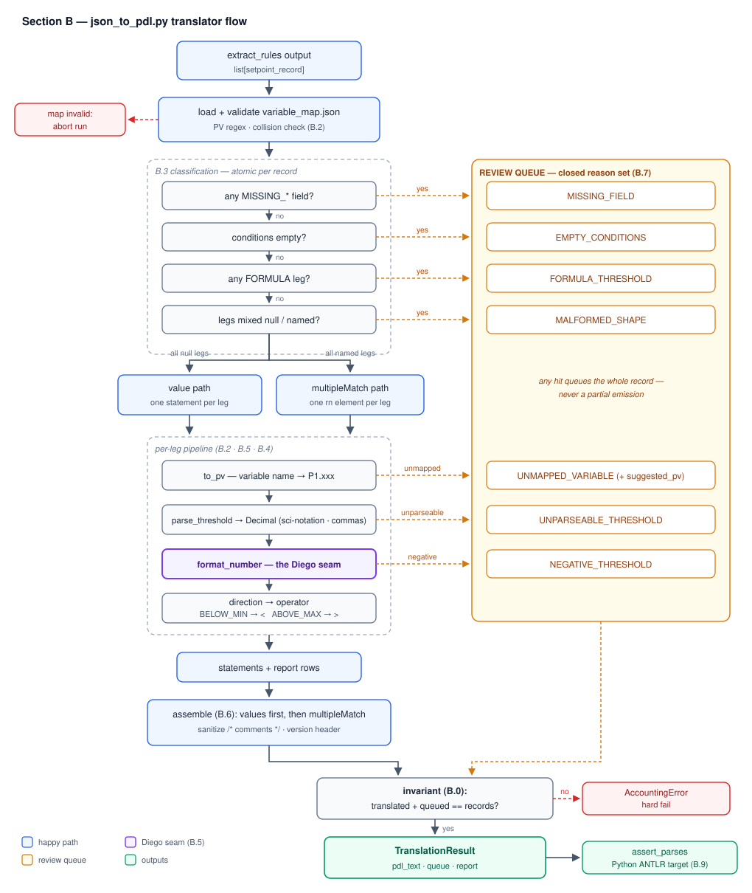
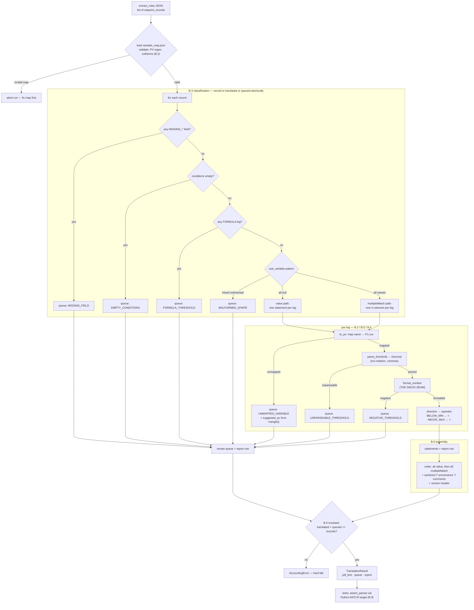

# Section B Spec: Name Mapping + Deterministic JSON → PDL Translator

Section B of the docs→PDL roadmap (Phases 2–3): the variable name map and the
deterministic translator `json_to_pdl.py`. Written 2026-07-10. Depends on
Section A only through the number-formatting policy (B.5 layer 2), which is
isolated so the pending grammar decision with Diego changes one function.

The *why* behind every decision here is in `SECTION_B_RATIONALE.md` (same
section numbering).

---

## How this works in five sentences

The translator takes each JSON setpoint record, looks up its variable name in
`variable_map.json` (e.g. "Coolant Header Pressure" → `P1.coolantheaderpressure`),
turns its direction into an operator (`BELOW_MIN` → `<`, `ABOVE_MAX` → `>`),
and prints one PDL line like `value P1.coolantheaderpressure < 1420.;` —
that's the whole idea. Records whose legs name sub-variables become one
`multipleMatch (...) (...)` line instead of `value` lines. Anything the
translator can't handle safely (missing fields, formulas, unknown variables,
weird thresholds) is never guessed at — the whole record goes to a review
queue with a reason code, for a human to fix and re-run. At the end it proves
nothing was lost (`translated + queued == records`) and emits the file with
all `value` lines before any `multipleMatch` (the grammar requires that
order). Everything else in this spec is guard rails around those five
sentences; day to day you only touch `variable_map.json` (paste the queue's
suggested names) and, when the grammar decision lands, `format_number`.

---

## Flow diagram


![[Pasted image 20260710224955.png]]

<details>
<summary>Mermaid source (kept for editing; the SVG above is the rendered version)</summary>



</details>

Reading notes: any leg-level failure (right column of queue boxes) queues the
*whole record* — partial emission never happens. The queue boxes are the seven
closed reason codes from B.7. `format_number` is deliberately the smallest box
on the happy path: it is the only node the Section A grammar decision touches.

---

## B.0 Contract

**Input:** the output of `extract_rules()` — a `list[setpoint_record]`
(Pydantic models from `backend/important_files/json_schema.py`), or the
JSON-dict equivalent after Gate A editing. The translator must accept both
(normalize via `model_dump()` when the object has it).

**Output:** three artifacts per run, all derived from the *same* pass:

1. **PDL text** — a string conforming to `MonitoringNeeds.g4`, containing only
   `value` and `multipleMatch` statements.
2. **Review queue** — records that could not be translated, each with a
   machine-readable reason.
3. **Translation report** — the per-record → per-statement mapping Gate B
   displays.

**Invariants (non-negotiable):**

- `len(records) == len(translated) + len(queued)` — checked at the end of every
  run; violation raises, never warns.
- Determinism: identical input + identical variable map + identical translator
  version ⇒ byte-identical PDL text. No timestamps in the output body
  (document ID and version in the header are fine; if a timestamp is wanted,
  it goes in the report, not the PDL).
- The translator never mutates a threshold digit except the two sanctioned
  rewrites: scientific-notation expansion and the integer decimal-point suffix.

## B.1 File layout

```
backend/
  json_to_pdl.py                      # the translator (single module is fine)
  important_files/
    variable_map.json                 # name mapping (B.2)
  tests/
    test_json_to_pdl.py               # golden + edge tests (B.8)
    parsing/                          # generated Python ANTLR target (B.9)
```

## B.2 Variable map

**File format** (`variable_map.json`):

```json
{
  "process": "P1",
  "variables": {
    "Coolant Header Pressure": "coolantheaderpressure",
    "Steam Flow": "steamflow"
  }
}
```

- Keys: the *exact* strings that appear in JSON `variable` / `sub_variable`
  fields. Lookup is exact-match after `.strip()` — no fuzzy matching, ever
  (a fuzzy match that lands wrong silently cross-wires two setpoints).
- Values: the local PV name, matching `[a-z0-9.]+` (lowercase because the
  process prefix supplies the mandatory initial capital).
- Emitted PV = `{process}.{local}`, e.g. `P1.coolantheaderpressure`. The full
  result must match the PV token: `^[A-Z][0-9a-z.]*$`.

**Functions:**

```python
def mangle(variable: str) -> str
    # lowercase; keep [a-z0-9]; drop everything else (spaces, hyphens,
    # slashes, unicode). "Feed/Steam Flow Mismatch" -> "feedsteamflowmismatch"
    # Used ONLY to propose names for queue entries — never to emit.

def to_pv(variable: str, vmap: VariableMap) -> str   # raises UnmappedVariable
```

**Load-time validation** (fail fast, before translating anything):

- every value matches the local-name regex;
- values are unique — two keys mapping to one local name is a **PV
  collision**; reject the map and name both offending keys;
- `process` matches `^[A-Z][0-9a-z]*$`.

## B.3 Record classification

Classify each record by its `conditions` list, checks in this order:

| # | Check | Outcome |
|---|---|---|
| 1 | any field anywhere equals/starts with `"MISSING_"` | queue: `MISSING_FIELD` (name the field) |
| 2 | `conditions` empty | queue: `EMPTY_CONDITIONS` |
| 3 | any condition has `threshold_type == "FORMULA"` | queue: `FORMULA_THRESHOLD` |
| 4 | legs are *mixed* (some `sub_variable` null, some named) | queue: `MALFORMED_SHAPE` |
| 5 | all legs `sub_variable: null` | **simple/two-sided** → one `value` statement *per leg* (1 leg = simple, 2 = two-sided; N generalizes for free) |
| 6 | all legs `sub_variable` named | **conjunctive** → one `multipleMatch` with one `rn` element per leg (do not assume 2) |

Rule 5 deliberately makes "simple" and "two-sided" the same code path — a
two-sided bound *is* two independent value statements (dissertation §3.1.1.2,
Fig 3.4). Don't special-case it.

Queue checks 1–4 inspect the *whole* record before emitting anything — a
record is translated atomically or queued atomically, never half-emitted.

## B.4 Direction → operator

```python
OPERATOR = {"BELOW_MIN": "<", "ABOVE_MAX": ">"}
```

Strict inequalities only — the schema defines "equal to threshold" as
acceptable, and PDL states the alert condition. Any other direction value
(dicts edited at Gate A bypass Pydantic): queue `MALFORMED_SHAPE`. Never
default.

## B.5 Threshold normalization — the Diego seam

Two layers, kept separate.

**Layer 1 — `parse_threshold(raw: str) -> Decimal`** (policy-free).
Accepted input grammar, tried in order:

1. Plain decimal: `^[+-]?\d+(\.\d*)?$` (decide whether to also accept `.5` →
   `0.5`, and test whichever you choose)
2. Scientific notation, both spellings:
   - Unicode: `4.7×10⁻³` — translate superscripts via
     `str.maketrans("⁰¹²³⁴⁵⁶⁷⁸⁹⁻⁺", "0123456789-+")`; accept `×`, `x`, `*`
   - ASCII: `4.7e-3` / `4.7E-3`
3. Strip: surrounding whitespace, thousands commas (`1,941` → `1941`)

Anything else (`±` tolerances, time qualifiers, ranges, embedded units) →
`UNPARSEABLE_THRESHOLD`. Use `Decimal`, never `float`, so `0.0047` comes out
exact.

**Layer 2 — `format_number(d: Decimal) -> str`** (the policy function, ~5
lines, the only thing the Diego meeting can change):

Current policy (grammar as-is):

- `d < 0` → raise `NegativeThreshold` → queue `NEGATIVE_THRESHOLD`
- integral value → append trailing dot: `1420` → `"1420."` (forces `DOUBLE`
  lexing over `INT`)
- fractional → emit as-is: `"619.08"`, `"38.0"` (preserve written precision —
  `38.0` must NOT collapse to `38`)

**Digit-preservation rule:** if the raw input was already a plain decimal,
pass its digits through verbatim (plus the trailing-dot rule); only
sci-notation inputs get rewritten. This honors the pipeline-wide "never change
a digit" principle and keeps Gate B diffs readable.

## B.6 Statement emission

**Formats** (exact; single space between tokens; one statement per line):

```
value <PV> <op> <number>;
multipleMatch (<PV> <op> <number>) (<PV> <op> <number>);
```

**Ordering:** all `value` statements first, then all `multipleMatch` —
required by `masterRule`. Within each group, preserve input record order
(determinism + Gate B readability). Conjunctive legs keep their order within
the record.

**Provenance comments**, one per record, immediately above the record's
statement(s):

```
/* <function_name> | <units of each leg, comma-joined> | <source_text> */
```

**Comment sanitization — do not skip:** `source_text` comes from an OCR'd
document and may contain `*/`, which terminates the ANTLR comment and injects
garbage into the token stream. Replace `*/` → `* /` (and fold newlines to
spaces) in every string interpolated into a comment. This is the one injection
vector in the design.

**File header:**

```
/* generated by json_to_pdl v<TRANSLATOR_VERSION>
   document: <doc_id>
   records: <n> translated / <m> queued  */
```

`TRANSLATOR_VERSION` is a module-level constant bumped on any behavior change —
it is Gate B's re-review trigger.

**Empty input:** emit the header only. A header-only file must still parse
(all of `masterRule`'s children are `*`-quantified, so empty input should be
accepted — verify once in tests).

## B.7 Queue and report

**Queue entry:**

```json
{
  "record_index": 3,
  "function_name": "Feed Header Pressure - Low",
  "variable": "Feed Header Pressure",
  "reason": "FORMULA_THRESHOLD",
  "detail": "threshold '7.44 × T_loop − 2210' has threshold_type FORMULA",
  "suggested_pv": null,
  "source_text": "..."
}
```

Reason codes (closed set): `MISSING_FIELD`, `EMPTY_CONDITIONS`,
`FORMULA_THRESHOLD`, `MALFORMED_SHAPE`, `UNPARSEABLE_THRESHOLD`,
`NEGATIVE_THRESHOLD`, `UNMAPPED_VARIABLE`. For `UNMAPPED_VARIABLE`, populate
`suggested_pv` with `mangle(variable)` so Gate A resolution is one copy-paste
into `variable_map.json`.

**Report row** (one per record, both outcomes):

```json
{
  "record_index": 0,
  "function_name": "Coolant Header Pressure - Low",
  "outcome": "translated",
  "statements": ["value P1.coolantheaderpressure < 1420.;"],
  "thresholds": [{"raw": "1420", "emitted": "1420."}]
}
```

The `raw`/`emitted` pairs are the Gate B centerpiece — every normalization
visible side by side.

**Top-level API:**

```python
@dataclass
class TranslationResult:
    pdl_text: str
    queue: list[QueueEntry]
    report: list[ReportRow]
    translated_count: int
    queued_count: int

def translate(records, vmap: VariableMap, doc_id: str = "unknown") -> TranslationResult
    # runs the invariant check before returning; raises AccountingError on imbalance
```

Pure function, no I/O — file writing is the caller's job (`backend.py` wires
it in Section C).

## B.8 Test plan

**Golden tests** — the eight examples in the `extract_rules` system prompt are
ready-made input/output pairs:

| Example | Expected |
|---|---|
| 1 | `value P1.coolantheaderpressure < 1420.;` |
| 2 | `value P1.turbinecasingpressure > 92.4;` |
| 3 | `value P1.surgetanklevel < 30.2;` + `value P1.surgetanklevel > 74.8;` (one comment, two statements) |
| 4 | queued: `FORMULA_THRESHOLD` |
| 5 | `multipleMatch (P1.steamflow > 38.0) (P1.drumlevel < 22.);` |
| 6 | two records → two `value` statements, separate comments |
| 7 | `value P1.ventstackradiation > 0.0047;` (sci-notation expansion) |
| 8 | `[]` → header-only file, zero queue |

**Edge tests:**

- `MISSING_UNITS` → queue
- mixed-leg record → `MALFORMED_SHAPE`
- 3-leg conjunctive → 3 `rn` elements
- unmapped variable → queue with `suggested_pv`
- negative threshold → `NEGATIVE_THRESHOLD`
- `1,941` → `1941.`; `38.0` stays `38.0`
- `source_text` containing `*/` → sanitized, output still parses
- map with duplicate local names → rejected at load
- accounting invariant: force an imbalance (monkeypatch) → raises
- values-before-multipleMatch ordering when record shapes interleave
- determinism: translate twice, assert byte equality

## B.9 Parse-check harness (pulled forward from Phase 0; no Diego required)

Generate the Python target once:
`antlr4 -Dlanguage=Python3 MonitoringNeeds.g4`
(needs `antlr4-python3-runtime` in the venv; same Java ≤ 21 constraint as the
ANTLR readme). Wrap it:

```python
def assert_parses(pdl_text: str) -> None
    # lex + parse with a BailErrorStrategy / error listener that raises on any
    # syntax error; ANTLR's default recovery prints to stderr and CONTINUES —
    # that must be turned into a hard failure.
```

Every golden test ends with `assert_parses(result.pdl_text)`. If the Python
target stalls on Java/version friction, `pytest.mark.skipif` those assertions
on the generated files' absence so pure-Python tests still run — but the
harness is part of Section B's exit criterion, not optional.

## B.10 Build order

1. `parse_threshold` + `format_number` + tests (pure functions, zero
   dependencies) — also where unanticipated threshold formats will surface.
2. Variable map load/validate + `mangle`/`to_pv` + tests.
3. Classification + emission + the 8 golden tests.
4. Queue/report/invariant.
5. Parse-check harness; wire `assert_parses` into the goldens.

**Section B exit criterion:** all golden + edge tests pass, every emitted PDL
string parse-checked, and the one file encoding a pending decision
(`format_number`) small enough to rewrite in five minutes after the Diego
meeting.

---

## Watch-outs while building

- The comment-sanitization item in B.6 is the easiest to forget and the only
  correctness hazard that *grows* with real documents.
- If example 3's "one comment, two statements" grouping ever fights the
  values-first ordering (a conjunctive record between two value records),
  resolve it by attaching comments to statements, not records — duplicate the
  comment if a record's statements ever split.
