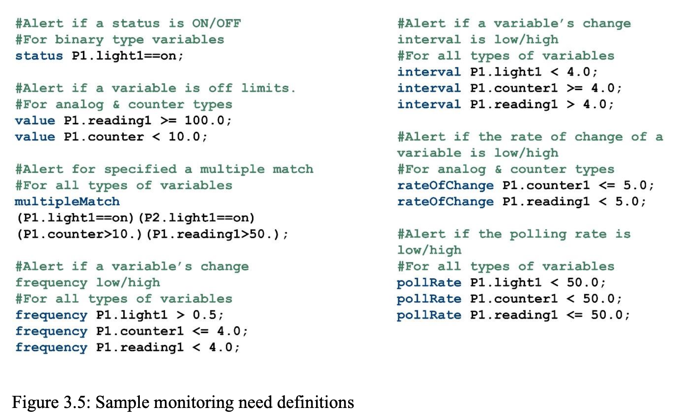
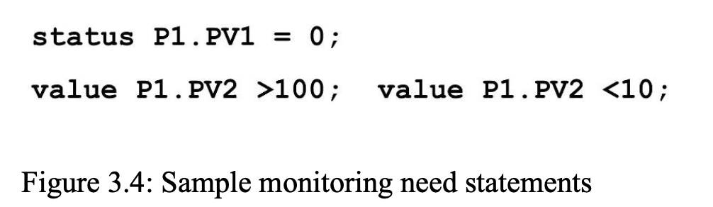

# Planning + Notes for translation of JSON to PDL. Notes by An Truong and assisted by Claude

# Note that we focused on Monitoring Needs. Process objects are currently out of scope!

## Plan

## Notes

### Field-by-field mapping

| JSON field                              | PDL element                                 | How                                                                                                                                                                                                                                                                                                                                                                   |
| --------------------------------------- | ------------------------------------------- | --------------------------------------------------------------------------------------------------------------------------------------------------------------------------------------------------------------------------------------------------------------------------------------------------------------------------------------------------------------------- |
| `variable` (+ `sub_variable` when set)  | PV token                                    | Becomes the process-qualified variable name, e.g. `P1.pzrpressure`. Needs a name-mangling step.                                                                                                                                                                                                                                                                       |
| `conditions[].direction`                | OPERATOR                                    | This is the deterministic derivation the prompt promises downstream: BELOW_MIN → `<`, ABOVE_MAX → `>`. Schema says "equal to threshold is acceptable," and PDL's value statement states the alert condition, so the violation is strictly `<` or `>`. This matches dissertation Figure 3.4: a 10–100 acceptable range becomes `value P1.PV2 >100; value P1.PV2 <10;`. |
| `conditions[].threshold` (NUMERIC)      | DOUBLE                                      | The constant compared against. Must be a plain decimal (see gaps — scientific notation and integer-looking values both break the lexer).                                                                                                                                                                                                                              |
| `conditions[].threshold_type` = FORMULA | no counterpart                              | PDL's value rule only accepts `PV OPERATOR DOUBLE` — a constant. See gaps.                                                                                                                                                                                                                                                                                            |
| `conditions[].units`                    | no counterpart (nearest home: adConverters) | Monitoring statements are unitless; units are implicit in the A/D converter's engineering range (`r: ID ':' INT ':' DOUBLE ':' DOUBLE ';'` = variable : bits : range-low : range-high). The unit string itself is dropped.                                                                                                                                            |
| `function_name`                         | none — emit as a `/* comment */`            | PDL has no trip-name concept. COMMENT is `-> skip`, so it's a safe provenance carrier.                                                                                                                                                                                                                                                                                |
| `source_text`                           | none — emit as a `/* comment */`            | Same; it exists for the human-review stage, not for the compiler.                                                                                                                                                                                                                                                                                                     |

## Things to consider

There are other five monitoring constructs (status, frequency, interval, rateOfChange, pollRate) referenced in Nivethan's Dissertation. However, we focused on specifically extracting setpoints, so we will note this as out of scope for the current research period and for future accomplishment.

# Sample Monitoring Needs statement from Nivethan's Dissertation

Note how there is no spaces (P1.PV1, P1.PV2, etc). 