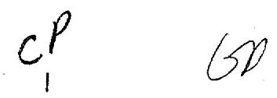
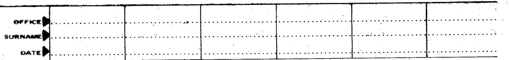
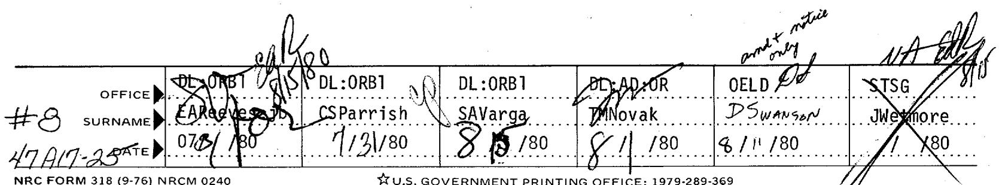
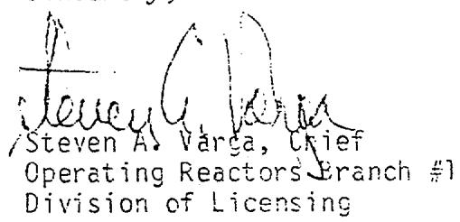
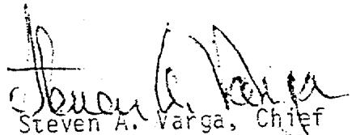

## AUGUST 14 1900

Mr. F. L. Clayton Senior Vice President Alabama Power Compary Post 0ffice Box 2641 Birmingham, Alabama 35291

Dear Mr. Clayton:

The Commission has issued the enclosed Amendment No. 15 to Facility Operating License No. NPF-2 for the Joseph M. Farley Nuclear Plant, Unit No. 1. The amendment consists of changes to the Technical Specifications in response to your application transmitted by letter dated August 30, 1979 supplemented by 1etter dated March 31, 1980 and your application dated June 2, 1980.

The amendinent changes the low low steam generator water level reactor trip setpoint to compensate for high containment temperatures following a postulated high energy line break. A second change corrects an error in the minimum number of 600 volt load centers.

Copies of the Safety Evaluation and the Notice of Issuance are also enclosed.

Sincerely,

## Original signed by: S. A. Varga

Steven A. Varga, Chief Operating Reactors Branch #1 Division of Licensing

Enclosures:

1. Amendment No./5 to NPF-1

2. Safety Evaluation

3. Notice of Issuance

cc: w/enclosures See next page

8009110030

Distribution

NRC PDR

Local PDR

C. Parrish

Attorney, OELD

TERA

I&E (5)

NSIC

B. Scharf (10)

NRR Reading

B. Jones (4)

ORB1 Reading

ACRS (16)

H. Denton

R. Diggs

D. Eisenhut

C. Stephens

R. Purple

C. Miles

R. Tedesco

L. Kintner

G. Lainas

T. Novak

J. 01shinski

J. Heltemes

S. Varga

TACS 12192 and 42172 - COMPLETE

Mr. F. L. Clayton Senior Vice President Alabama Power Company Post Office Box 2641 Birmingham, Alabama 35291

Dear Mr. Clayton:

The Coirission has issued the enclosed Amendment No. 15 to Facility Coeratina License No. NPF-2 for the Joseph M. Farley Nuclear Plant, Unit lio. l. The amendment consists of changes to the Technical Specifications in response to your application transmitted by letter dated August 30, 1979 supplemented by letter dated March 31, 1980 and your application dated June 2, 1980.

The amendment changes the low low steam generator water level reactor trip setpoint to compensate for high containment temperatures following a postulated high energy line break. A second change corrects an error in the minimum number of 600 volt load centers.

Copies of the Safety Evaluation and the Notice of Issuance are also enclosed.

Sincerely,

Enclosures:

ce: w/enclosures See next page

Mr. F. L. Clayton Alabama Power Company

Alan R. Barton Executive Vice President Alabama Power Company Post 0ffice Box 2641 Birmingham, Alabama 35291

Ruble A. Thomas, Vice President Southern Company Services, Inc. Post 0ffice Box 2625 Birmingham, Alabama 35202

Georoe F. Trowbridge, Esquire Shaw, Pittman, Potts and Trowbridge 1800 M Street, N.W. Washington, D. C. 20036

Chairman Houston County Commission Dothan, Alabama 36301

Mr. Robert A. Buettner, Esquire   
Balch, Bingham, Baker, Hawthorne, Williams and Ward   
Post Office Box 306   
Birmingham, Alabama 35201

Edward H. Keiler, Esquire Keiler and Buckley 9047 Jefferson Highway River Ridge, Louisiana 70123

George S. Houston Memorial Library 212 W. Burdeshaw Street Dothan, Alabama 36303

State Department of Public Health ATTN: State Health Officer State Office Building Montgomery, Alabama 36104

Director, Technical Assessment Division Office of Radiation Programs (AW-459) U. S. Environmental Protection Agency Crystal Mall #2 Arlington, Virginia 20460

August 14, 1980

U. S. Environmental Protection Agency Region IV Office   
ATTN: EIS COORDINATOR   
345 Courtland Street, N.E.   
Atlanta, Georgia 30308

# AMENDMENT TO FACILITY OPERATING LICENSE

Amendment No. 15   
License No. NPF-2

1. The Nuclear Regulatory Commission (the Commission) has found that:

A. The application for amendment by Alabama Power Company (the licensee) dated August 30, l980 (supplemented by letter dated March 31, 1980) and application dated June 2, 1980, comply with the standards and requirements of the Atomic Energy Act of 1954, as amended (the Act) and the Commission's rules and regulations set forth in 10 CFR Chapter I;

B. The facility will operate in conformity with the application, the provisions of the Act, and the rules and reçulations of the Commission;

C. There is reasonable assurance (i) that the activities authorized by this amendment can be conducted without endangering the lealti and safety of the public, and (ii) thet such activities will be conducted in compliance with the Commissicn's regulations;

D. The issuance of this amendment will not be inimical to the commcn defense and security or to the health and safety of the public; and

E. The issuance of this amendment is in accordance with l0 CFR Part 51 cf the Commission's regulations and all applicable requiremert: have beer satisfied.

2. Accordingly, the license is amended by changes to the Technical Specifications as indicated in the attachment to this license amendment, and paragraph 2.C.(2) of Facility Operating License No. NPF-2 is hereby amended to read as follows:

(2) Technical Specifications

The Technical Specifications contained in Appendices A and B, as revised through Amendment No. 15, are hereby incorporated in the license. The licensee shall operate the facility in accordance with the Technical Specifications.

3. This license amendment is effective as of the date of its issuance.

FOR THE NUCLEAR REGULATORY COMMISSION

Operating Reactors Branch # Division of Licensing

Changes to the Technical

Specifications

Date of Issuance: August 14, 1980

<table><tr><td>Revise Appendix A as follows:</td><td>Insert Paçes</td></tr><tr><td>Remove Pages</td><td></td></tr><tr><td>2-6</td><td>2-6</td></tr><tr><td>3-26 3/4 8-7</td><td>3-26 3/4 8-7</td></tr></table>

TABLE 2.2-1 (Continued)  
REACTOR TRIP SYSTEM INSTRUMENTATION TRIP SETPOINTS
<table><tr><td>FUNCTIONAL UNIT</td><td>TRIP SETPOINT</td><td>ALLOWABLE VALUES</td><td></td></tr><tr><td>13. Steam Generator Water Level--Low-Low</td><td></td><td>&gt; 17% of narrow range instrument span-each steam generator</td><td>≥ 16% of narrow range instrument span-each steam generator</td></tr><tr><td></td><td>14. Steam/Feedwater Flow Mismatch and Low Steam Generator Water Level</td><td>&lt; 40% of full steam flow at RATED THERMAL POWER coincident with steam generator water level ≥ 25% of narrow range instru-</td><td>&lt; 42.5% of ful] steam flow at RATED THERMAL POWER coincident with steam generator water level ≥ 24% of narrow range instru- ment span--each steam generator</td></tr><tr><td></td><td>15. Undervoltage-Reactor Coolant Pumps</td><td>ment span--each steam generator ≥ 2680 volts-each bus</td><td>≥ 2640 volts-each bus</td></tr><tr><td></td><td>16. Underfrequency-Reactor Coolant Pumps</td><td>≥ 57.0 Hz - each bus</td><td>≥ 56.9 Hz - each bus</td></tr><tr><td>17. Turbine Trip</td><td>A. Low Auto Stop Oil</td><td>≥ 45 psig</td><td>≥ 43 psig</td></tr><tr><td>B.</td><td>Pressure Turbine Throttle Valve</td><td>≥ 1% open</td><td>≥ 0.75% open</td></tr><tr><td></td><td>Closure 18. Safety Injection Input</td><td>Not Applicable</td><td>Not Applicable</td></tr><tr><td>from ESF 19. Reactor Coolant Pump</td><td></td><td>Not Applicable</td><td>Not Applicable</td></tr><tr><td></td><td>Breaker Position Trip</td><td></td><td></td></tr><tr><td colspan="2">FUNCTIONAL UNIT</td><td>TRIP SETPOINT</td><td>ALLOWABLE VALUES</td></tr><tr><td colspan="2">6. Auxiliary Feedwater</td><td></td><td></td></tr><tr><td>a.</td><td>Steam Generator Water Level-Low-Low</td><td>≥ 17%of narrow range instrument span-each steam generator</td><td>≥ 16% of narrow range instru- ment span-each steam generator</td></tr><tr><td>b.</td><td>Undervoltage - RCP</td><td>≥ 2680 RCP bus voltage</td><td>≥ 2640 RCP bus voltage</td></tr><tr><td>C.</td><td>S.I.</td><td>see l above (all SI Setpoints)</td><td></td></tr></table>

## ELECTRICAL POWER SYSTEMS

A.C. DISTRIBUTION - SHUTDOWN

## LIMITING CONDITION FOR OPERATION

3.8.2.2 As a minimum, the following train oriented A.C. electrical busses shall be OPERABLE and aligned to an OPERABLE diesel generator.

3 - 4160 volt Emergency Bus

4 - 600 volt Load Centers

2 - 120 volt A.C. Vital Busses

APPLICABILITY: MODES 5 and 6.

## ACTION:

With less than the above complement of A.C. busses OPERABLE and energized, establish CONTAINMENT INTEGRITY within 8 hours.

## SURVEILLANCE REQUIREMENTS

4.8.2.2 The specified A.C. busses shal1 be determined OPERABLE and energized at least once per 7 days by verifying correct breaker alignment and indicated power availability.

# SAFETY EVALUATION BY THE OFFICE OF NUCLEAR REACTOR REGULATION

# RELATED TO AMENDMENT NO. 15 TO FACILITY OPERATING LICENSE NO. NPF-2

ALABAMA POWER COMPANY

JOSEPH M. FARLEY NUCLEAR PLANT, UNIT NO. 1

DOCKET NO. 50-348

1. Low-Low Steam Generator Water Level Reactor Trip Setpoint

## INTRODUCTION

By letter dated August 30, 1980, supplemented by letter dated March 31, 31, 1980 the licensee (Alabama Power Company) proposed changes to the Technical Specifications for the Farley Nuclear Plant, Unit No. 1. The changes would increase the low-low steam generator water level reactor trip setpoint from 15% to 17% of the narrow range instrument scale. The revised value of l7% includes an allowance of 5% for channel accuracy, 10% for post-accident environmental effects on the differential pressure transmitter, and 2% for reference leg heatup compensation.

## DISCUSSION

High energy line breaks inside containment can result in heatup of the steam generator water level instrument's reference leg. Increased reference leg water column temperature will result in a decrease of the water column density with a consequent apparent increase in the indicated steam generator water level (i.e., indicated level exceeding actual level). This potential level bias could result in delayed protection signals (reactor trip and auxiliary feedwater initiation) that are based on low-low steam generator water level. For the case of a feedline rupture, this adverse environment could be present and could delay the primary signal arising from declining steam generator water level (low-low steam generator water level). High pressurizer pressure, over-temperature delta T, high containment pressure and safety injection are backup signals to steam generator water level with an adverse containment environment. For other high energy line breaks that could introduce a similar positive bias to the steam generator water level measurement, steam generator level does not provide the primary trip function and the potential bias would not interfere with needed protective system actuation.

## EVALUATION

Westinghouse (NSSS vendor for the Farley Plant) has advised that the potential temperature-induced bias described above can be compensated for by raising the steam generator low-low water level setpoint. Westinghouse has recommended a change in the allowable water level setpoint sufficient to accommodate the bias that could result from the highest containment temperatures possible prior to the occurrence of a containment high pressure trip. Based on the spectrum of steam line breaks for the Farley Nuclear Plant, this temperature is 238°F.

To correct the potential error, the licensee has added two inches of insulation to the reference leg to minimize the effect of adverse containment temperatures on the reference leg. The insulating material used is "Temp-Mat," a needled fiberglass insulation with no organic binder. The insulation is wrapped to prevent damage from condensation during an accident, protected from high energy line break jet impingement forces by physical location, and is qualified for use in a post-accident containment environment. Analyses, shown in the licensees letter of March 31, l980, have shown that with a boundary condition of 245°F, that after 5 minutes (the period of interest where the reactor trip function is needed) the total error resulting from the reference leg heatup is less than 2%.

Thus, the 2% increase in the low-low water level setpoint will provide a reactor trip and auxiliary feedwater initiation following a feedline rupture. The proposed change in setpoint will ensure that the trip setpoint maintains conservatism and compensates for the potential temperature induced error.

## CONCLUSION

Based on our review of the licensee's submittals, the proposed changes to Table 2.2-1 and Table 3.3-4 of the Technical Specifications are acceptable.

2. Correction of Number of 600 Volt Load Centers

## INTRODUCTION

By letter dated June 2, 1980, the licensee proposed a correction to Technical Specification 3.8.2.2. Another change relating to definition of the term "operable" contained in this same letter will be completed by separate amendment.

## EVALUATION

Technical Specification 3.8.2.2 lists the train-oriented AC electrical buses which shall be operable during Modes 5 and 6. The list contains five 600 volt load centers. Farley Plant has only four 600 volt load centers. Thus, the licensee has proposed a pro-forma change. We concur that this was an obvious typographical error which is now being corrected.

## ENVIRONMENTAL CONSIDERATION

We have determined that the amendment does not authorize a change in effluent types or total amounts nor an increase in power level and will not result in any significant environmental impact. Having made this determination, we have further concluded that the amendment involves an action which is insignificant from the standpoint of environmental impact and, pursuant to 10 CFR §51.5(d)(4), that an environmental impact statement or negative declaration and environmental impact appraisal need not be prepared in connection with the issuance of this amendment.

## CONCLUSION

We have concluded, based on the considerations discussed above, that: (1) because the amendment does not involve a significant increase in the probability or consequences of accidents previously considered and does not involve a significant decrease in a safety margin, the amendment does not involve a significant hazards consideration, (2) there is reasonable assurance that the health and safety of the public will not be endangered by operation in the proposed manner, and (3) such activities will be conducted in compliance with the Commission's regulations and the issuance of this amendment will not be inimical to the common defense and security or to the health and safety of the public.

Date: August 14, 1980

UNITED STATES NUCLEAR REGULATORY COMMISSION

DOCKET NO. 50-348

## ALABAMA POWER COMPANY

# NOTICE OF ISSUANCE OF AMENDMENT TO FACILITY OPERATING LICENSE

The U. S. Nuclear Regulatory Commission (the Commission) has

issued Amendment No. 15 to Facility Operating License No. NPF-2

issued to Alabama Power Company (the licensee), which revised Technical

Specifications for operation of the Joseph M. Farley Nuclear Plant,

Unit No. l (the facility) located in Houston County, Alabama. The

ammendment is effective as of the date of issuance.

The amendment changes the low-low steam generator water level

reactor trip setpoint to compensate for high containment temperature

following a postulated high energy line break. A second change corrects

an error in the minimum number of 600 volt load centers.

The application for the amendment complies with the standards

and requirements of the Atomic Energy Act of 1954, as amended (the

Act), and the Commission's rules and regulations. The Commission has

lade appropriate findings as required by the Act and the Comnission's

rules and regulations in 10 CFR Chapter I, which are set forth in

the license amendment. Prior public notice of this amendment was

not required since this amendment does not involve a significant hazards

consideration.

The Commission has determined that the issuance of this amendment will not result in any significant environmental impact and that pursuant to 10 CFR §51.5(d)(4) an environmental impact statement or negative declaration and environmental impact appraisal need not be prepared in connection with issuance of this amendment.

For further details with respect to this action, see (1) the application for amendment dated March 30, 1979, supplemented by letter dated March 31, 1980 and your application dated June 2, 1980, (2) Amendment No. 15 to License No. NPF-2, and (3) the Commission's related Safety Evaluation. All of these items are available for public inspection at the Commission's Public Document Room, 1717 H Street, N.W., Washington, D.C. and at the George S. Houston Memorial Library, 212 W. Burdeshaw Street, Dothan, Alabama 36303. A copy of items (2) and (3) may be cotained upon request addressed to the U. S. Nuclear Regulatory Commission. Weshington, D.C. 20555, Attention: Director, Division of Operating Reactors.

Dated at Bethesda, Maryland, thisl4th day of August 1980.

FOR THE NUCLEAR REGULATCRY COMMISSION

Varga, Operating Reactors Branch 1 Division of Licensing